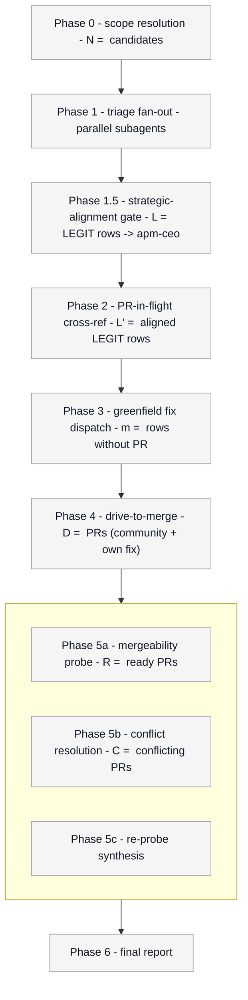

# Progress diagram (operator visibility contract)

Consumed by: `../SKILL.md` (architecture invariant
"Operator visibility is a contract, not a courtesy" + Phase 0..6
boundary directives).

The orchestrator MUST render this mermaid diagram to the operator
chat:

1. ONCE at the start of the run, right after Phase 0 scope is
   resolved, with EVERY phase styled `pending`.
2. AT EACH phase boundary, with the just-entered phase styled
   `active` and all earlier phases styled `done` (or `blocked` /
   `skipped` where applicable).
3. ONCE at the end of the run with every phase styled `done` (or
   `blocked` where the human-escalation queue is non-empty).

Re-print the live ground-truth table BELOW the diagram every time.
The diagram answers "where are we"; the table answers "what's the
state of each candidate".

## Color contract

Five states. Pick palette for legibility on both light and dark
terminal renderers. Stroke-width 3px on the ACTIVE node so the
operator's eye lands there first (B8 ATTENTION ANCHOR).

| state    | fill      | stroke    | stroke-width | semantics                          |
|----------|-----------|-----------|--------------|------------------------------------|
| pending  | `#f5f5f5` | `#9ca3af` | 1px          | not started yet                    |
| active   | `#dbeafe` | `#2563eb` | 3px          | currently executing (one at a time)|
| done     | `#dcfce7` | `#16a34a` | 1px          | completed cleanly                  |
| blocked  | `#fef3c7` | `#d97706` | 2px          | partial completion, human follow-up|
| skipped  | `#f3f4f6` | `#6b7280` | 1px,dasharray| no work in this phase (e.g. 0 fix) |

Labels stay ASCII printable. No emoji, no unicode arrows in node
text (the mermaid edge arrows themselves are fine - they render to
SVG / ASCII in any terminal markdown viewer).

## Diagram template

Substitute the cardinalities (`<N>`, `<L>`, `<L_prime>`, `<m>`,
`<D>`, `<R>`, `<C>`) with the live numbers known at each phase
boundary. Substitute the `:::<state>` class on each node based on the
contract above. Node labels are single-line (use " - " as the inline
separator, NOT `<br/>`, which fails to render in some markdown viewers).



## When to use each state

- **Pending** -- every phase at the very first render.
- **Active** -- the phase the orchestrator is about to spawn into.
  EXACTLY ONE node should be `active` at any time. Use stroke-width
  3px so the operator's attention lands there.
- **Done** -- the phase completed and the table reflects its
  outputs. All earlier phases at each boundary render as `done`
  unless they hit a `blocked` or `skipped` state.
- **Blocked** -- a row in the table is unresolved AND the orchestrator
  declines to push it further this run (e.g. `#1326` security needs
  human escalation, `#1363` needs author repro). The phase that
  surfaced the blocker stays `done` for the overall run, but its
  status line in the live table reports the blocker count.
- **Skipped** -- the cardinality for the phase is 0 (e.g. zero rows
  routed to fix-dispatch because all LEGIT issues already have a PR
  in flight). Render with stroke-dasharray so the operator sees the
  phase ran-but-no-op.

## What to print, exactly

At each phase boundary (and once at the start, once at the end):

```
## Progress (Phase <N> - <name>)

<mermaid block from template above with current state classes>

### Live ground-truth table

<the current ground-truth-table.md rendered with all rows>
```

Both the diagram and the table go to chat output, not to plan.md.
Plan.md retains the canonical table for the orchestrator's own
re-reads at phase boundaries (B4 PLAN MEMENTO); chat output is for
the operator's situational awareness.

## Dispatch-time table requirement

When spawning a fan-out wave (Phase 1, 1.5, 3, 4, 5b), the
orchestrator MUST also print the dispatch table BEFORE issuing the
parallel spawns, so the operator sees which subagent is doing what:

```
### Dispatch (Phase <N>) -- <k> parallel subagents

| subagent_id              | target            | role                |
|--------------------------|-------------------|---------------------|
| triage-1435              | issue #1435       | reproduce on HEAD   |
| ceo-align-1435           | issue #1435       | strategic alignment |
| resolve-conflicts-1396   | PR #1396          | rebase + resolve    |
| ...                      | ...               | ...                 |
```

This is mandatory so the operator can correlate completion
notifications back to candidates without reading the full plan.md.

## Examples

### Run start (Phase 0 just completed; 14 candidates)

`P0` is `done`. `P1` is `active`. Everything else `pending`. Cardinalities
in the labels are populated for P0 and P1 only (we don't yet know L,
k, m, F).

### After Phase 2

`P0`, `P1`, `P2` are `done`. `P3` is `active` (greenfield fix
dispatch). `P4` and `WAVE4` `pending`. `L`, `L_prime`, `m` populated;
`D` still unknown (it is the count of own fix PRs from Phase 3 plus
community PRs from Phase 2, finalized when Phase 3 returns).

### Skipped strategic-alignment gate

When `L = 0` (zero LEGIT rows from Phase 1), render `P15` with class
`skipped` and label `Phase 1.5 - strategic-alignment gate - L = 0 (skipped)`.
The gate had no rows to inspect; pass through to Phase 2 with
`L_prime = 0` also.

### Skipped fix wave

When `m = 0` (all LEGIT issues have community PRs in flight), render
`P3` with class `skipped` and label `Phase 3 - greenfield fix dispatch - m = 0 (skipped)`.
The drive wave (`P4`) still runs over the community PRs.

### Skipped conflict resolution

When `C = 0` (every ready PR is MERGEABLE on first probe), render
`P5b` with class `skipped` and label `Phase 5b - conflict resolution - C = 0 (skipped)`.
`P5a` and `P5c` still render `done`; the gate ran, just had nothing to do.

### After Phase 4 with conflicts present

`P0`, `P1`, `P2`, `P3`, `P4` all `done`. `WAVE4` subgraph: `P5a`
`done`, `P5b` `active`, `P5c` `pending`. `R` populated from
drive-wave returns; `C` populated from 5a probe (e.g. `C = 2 of 6`).

### End of run with blockers

`P0..P6` all `done`. The table below shows N rows with `blocked` status
for the human-escalation queue. The diagram itself stays green - it
tracks phase completion, not row-level status.
