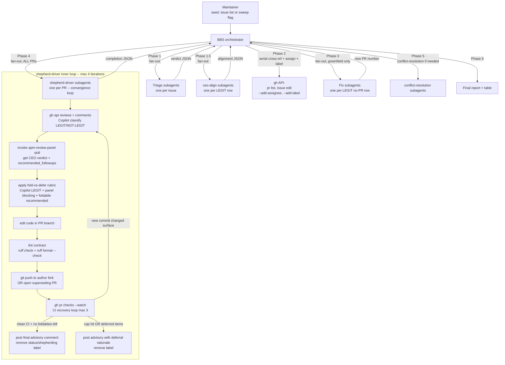

<!--
batch-bug-shepherd - genesis design artifact
============================================

This file is the design record for the BBS refactor that closes four
production gaps surfaced in Q4: missing fold-vs-defer discipline,
missing copilot-pull-request-reviewer[bot] address loop, missing CI
verification loop, missing ownership-signaling (assignee + label).

It follows the genesis 8-step process. SKILL.md is the natural-
language module derived from this design; readers auditing the
structure should start here, not in SKILL.md.

ASCII only. No emojis, no em dashes, no box-drawing.
-->

# batch-bug-shepherd - design.md

## Step 1. Intent + scope

batch-bug-shepherd (BBS) is an outer-loop orchestrator that takes a
batch of suspected bugs in microsoft/apm and drives each one from raw
issue list to a mergeable PR queue. It fans out triage subagents per
issue, cross-references each LEGIT issue against open PRs, then
dispatches per-PR shepherd-driver subagents that run an iterative
convergence loop (Copilot review classification + apm-review-panel +
fold-or-defer recommendation handling + push + CI watch) until the PR
is either ship-ready or terminally blocked. The boundary: BBS does
NOT author panel personas, does NOT compute coverage, does NOT
auto-merge, and is NOT a single-PR review tool (use apm-review-panel
directly for that).

The frontmatter description preserved on SKILL.md keeps the same
activation triggers (sweep / shepherd / drive community PRs / weekly
bug sweep) so the dispatcher still resolves the skill on the same
linguistic surface.

## Step 2. Actors and data flow



Data flow notes:

- All write effects to GitHub (assignee, label, comment, push, close)
  travel through `gh` / `git` CLIs invoked by either the orchestrator
  (assign + label only) or the shepherd-driver subagent (everything
  PR-side). The orchestrator NEVER posts to a PR.
- Ground-truth state is the markdown table in plan.md. Subagents
  return JSON; orchestrator parses, schema-validates, and rewrites
  the table on every return.
- The shepherd-driver loop is the only place fold-vs-defer, Copilot,
  and CI logic live. The orchestrator cannot reach into the loop; it
  only consumes the terminal `completion_return` JSON.

## Step 3. Invariants and anti-patterns

### Must-hold (invariants)

I1. **Fan-out over serial.** Triage, alignment, fix, and shepherd-
    driver are parallel child threads. Subagent capacity is unlimited
    and is NEVER a deferral reason.

I2. **Ownership is signaled the moment BBS touches an issue or PR.**
    `--add-assignee @me` and `--add-label status/shepherding` are
    applied at pickup; the label is removed on terminal state
    (merged, advisory-posted-with-deferred-items, or blocked).
    Assignment stays. The label is created on demand
    (`gh label create status/shepherding --color B8860B
    --description "Actively being driven by an APM shepherd run"
    --force`).

I3. **Default is fold. Defer is the exception that must justify
    itself.** This is the load-bearing reframe of the refactor. The
    fold-vs-defer rubric (`assets/fold-vs-defer-rubric.md`) is the
    only authority for the decision; any deferral MUST cite the
    scope boundary that was crossed in one line.

I4. **Copilot review is a first-class signal.** Phase X.0 of every
    shepherd-driver iteration fetches
    `copilot-pull-request-reviewer[bot]` review and inline comments,
    classifies each item LEGIT / NOT-LEGIT with one-line rationale,
    and folds LEGIT items into the same commit family as panel
    follow-ups. Max 2 Copilot rounds per shepherd-driver run, then
    Copilot is declared drained.

I5. **CI must be green before final advisory.** Every push is
    followed by `gh pr checks --watch` (or equivalent poll). Red
    checks trigger the CI recovery loop (`assets/ci-recovery-
    checklist.md`); transient infra hiccups get one `gh run rerun
    --failed`; persistent failures get a fix. Max 3 CI fix
    iterations per shepherd-driver run.

I6. **One advisory comment per PR per shepherd-driver run.** The
    apm-review-panel skill's own single-writer contract is honored
    inside the loop, but the FINAL panel pass (the one that yields
    `ship_now` with zero foldable items, OR that hits the iteration
    cap) is the only one whose comment is left visible. Earlier
    in-loop panel comments are obsoleted by the final pass; the
    shepherd-driver lets them stand (the panel skill rewrites the
    same comment via its idempotency contract).

I7. **Verify before fix.** No fix subagent dispatches until the
    issue is reproduced on HEAD (verdict LEGIT).

I8. **PR-in-flight detection is mandatory.** Skipping Phase 2 risks
    duplicating community work; that is the worst failure mode this
    skill defends against.

I9. **Mutation-break gate.** A regression-trap test is REAL only
    when deleting the production guard makes it FAIL. Enforced in
    both fix subagent and shepherd-driver subagent (whenever a new
    regression test is added).

I10. **ASCII only.** All artifacts (table, comments, commit
     messages, templates, prompts) stay within printable ASCII.

I11. **Lint contract is the push gate.** Both ruff commands must be
     silent before any push.

I12. **Iteration cap is the safety valve.** Hard cap 4 outer
     iterations per shepherd-driver. On cap hit, advisory comment
     posted with explicit "remaining items + deferral rationale"
     section; label removed; row marked blocked or
     advisory-with-deferred in the table.

### Must-not-do (anti-patterns)

A1. Subagent capacity is NOT a deferral reason. Never write
    "deferred because we ran out of subagents". We have unlimited
    subagents.

A2. Never separate "blocking" from "recommended" as the fold-vs-
    defer axis. The axis is SCOPE-CREEP, not severity. A blocking
    finding that touches a wholly different surface is deferred; a
    recommended finding that raises the bar of THIS PR's scope is
    folded.

A3. Never push without lint silent. Never push without addressing
    every LEGIT Copilot inline comment from this iteration's
    classification pass.

A4. Never declare ready-to-merge before CI is observed green. Stale
    cached `gh pr checks` output does not count; re-run after the
    last push.

A5. Never apply `panel-approved` / `panel-rejected` / any verdict
    label. The panel removed those; BBS honors the removal.

A6. Never leave `status/shepherding` on a PR after the shepherd-
    driver returns terminal. Stale labels are operator-misleading.

A7. Never auto-merge. The maintainer still ships.

A8. Never re-implement apm-review-panel internals. Compose, do not
    re-implement.

A9. Never post more than one Copilot-classification rationale to
    the PR. The classification lives in the shepherd-driver's
    scratch context and surfaces (one-liner per LEGIT item folded)
    in the final advisory comment's resolved-items section.

## Step 4. Phase decomposition and module boundaries

| # | Phase | Responsibility | Module |
|---|-------|----------------|--------|
| 0 | scope resolution | Resolve seed list, init table, print plan | SKILL.md (orchestrator inline) |
| 1 | triage fan-out | Reproduce on HEAD, classify | assets/triage-prompt.md |
| 1.5 | strategic alignment | apm-ceo persona checks alignment with PRINCIPLES.md | assets/strategic-alignment-prompt.md |
| 2 | PR-in-flight cross-ref + ownership signaling | gh pr list per LEGIT row; ASSIGN + LABEL for each picked-up issue and any in-flight PR | SKILL.md (orchestrator inline) |
| 3 | fix fan-out (greenfield) | TDD + mutation-break + open PR | assets/fix-prompt.md |
| 4 | shepherd-driver fan-out (convergence loop) | Copilot fetch + panel + fold/defer + push + CI watch + iterate (cap 4) | assets/shepherd-driver-prompt.md |
| 5 | conflict-resolution | Rebase any ready-to-merge PR that drifted on main | assets/conflict-resolution-prompt.md |
| 6 | final report | Render table + categorized PR list to operator | assets/final-report-template.md |

Key boundary decisions:

- **The old shepherd/completion split is collapsed.** Previously
  Phase 3a shepherd produced a verdict comment and stopped; Phase 4
  completion resolved blocking follow-ups and pushed. That split
  hard-coded a "post advisory, then maybe address it later" mental
  model -- precisely the anti-pattern (gap 1) we are closing. The
  refactor unifies them into a single shepherd-driver subagent that
  OWNS the full convergence of one PR. `assets/shepherd-prompt.md`
  and `assets/completion-prompt.md` are replaced by
  `assets/shepherd-driver-prompt.md` (justification: their content
  becomes incoherent in the new model; keeping them risks operator
  confusion about which prompt is canonical).

- **Ownership signaling moves to the orchestrator, not the
  subagent.** The orchestrator owns assign+label because (a) it
  happens BEFORE any subagent spawn and (b) it must happen even on
  Phase 3 own-fix PRs once the fix subagent returns the PR number.
  Pushing this into each subagent would duplicate the logic three
  ways.

- **Fold-vs-defer rubric is an asset, not inline prose.** The rubric
  is the load-bearing decision module; centralizing it lets us
  iterate on it without rewriting the SKILL.md every time.

- **CI recovery is an asset, not inline prose.** Same rationale;
  also lets `assets/fix-prompt.md` reference the same checklist
  when a greenfield-fix PR turns red on CI.

## Step 5. Interface contracts

### Orchestrator -> shepherd-driver (spawn inputs)

```
PR_NUMBER             integer, required
ISSUE_NUMBER          integer, required
AUTHOR                string (gh handle), required
HEAD_REPO             string (owner/repo), required
HEAD_BRANCH           string, required
MAINTAINER_CAN_MODIFY boolean, required
REPO_ROOT             absolute path, required
ORIGIN                "community" | "own-fix", required
PANEL_PRIOR           optional JSON: prior CEO verdict if loop is
                      resuming from a previous BBS session
```

### shepherd-driver -> orchestrator (return shape)

Extended `completion_return` (additive to existing schema):

```json
{
  "kind": "completion",
  "pr": 1234,
  "status": "ready-to-merge" | "blocked" | "superseded" | "advisory-with-deferred",
  "iterations": 1..4,
  "copilot_rounds": 0..2,
  "copilot_findings": [
    { "id": "string", "classification": "LEGIT" | "NOT-LEGIT",
      "rationale": "one line", "resolved_in": "commit sha" }
  ],
  "panel_final_verdict": "ship_now" | "ship_with_followups" | "needs_discussion" | "needs_rework",
  "folded_items": [
    { "source": "panel" | "copilot",
      "id": "string", "summary": "string",
      "resolved_in": "commit sha" }
  ],
  "deferred_items": [
    { "source": "panel" | "copilot",
      "id": "string", "summary": "string",
      "scope_boundary_crossed": "one line",
      "suggested_followup_issue": "optional issue ref" }
  ],
  "ci_evidence": "URL or summary, required when status in {ready-to-merge, advisory-with-deferred}",
  "ci_iterations": 0..3,
  "lint_evidence": "exit code + silent confirmation",
  "mutation_break_evidence": [...],
  "superseded_by": optional int,
  "blocker": "required when status=blocked"
}
```

### Copilot review fetch contract

```
gh api repos/microsoft/apm/pulls/<n>/reviews \
   --jq '.[] | select(.user.login=="copilot-pull-request-reviewer[bot]")'
gh api repos/microsoft/apm/pulls/<n>/comments \
   --jq '.[] | select(.user.login=="copilot-pull-request-reviewer[bot]")'
```

Each item is classified per `assets/copilot-classification-prompt.md`
into a `{id, classification, rationale}` triple. LEGIT items enter
the folded list. NOT-LEGIT items are listed in the final advisory
under "Copilot signals reviewed and declined" with the one-line
rationale.

### CI recovery contract

```
gh pr checks <n> --repo microsoft/apm --watch
# on RED:
gh run view <run-id> --repo microsoft/apm --log-failed
# classify per assets/ci-recovery-checklist.md:
#   - lint failure       -> rerun ruff locally, fix, push
#   - test failure       -> read trace, fix, push, repeat
#   - infra hiccup       -> gh run rerun <id> --failed (ONCE per id)
#   - persistent unknown -> raise to status=blocked
```

### Orchestrator ownership-signaling contract

```
# On Phase 2 pickup of a community PR, and on Phase 3 fix-subagent
# return of a new own-fix PR:
gh label create status/shepherding --color B8860B \
   --description "Actively being driven by an APM shepherd run" \
   --force --repo microsoft/apm
gh pr edit <n> --add-assignee @me --add-label status/shepherding \
   --repo microsoft/apm
gh issue edit <issue> --add-assignee @me \
   --add-label status/shepherding --repo microsoft/apm

# On shepherd-driver terminal return:
gh pr edit <n> --remove-label status/shepherding --repo microsoft/apm
gh issue edit <issue> --remove-label status/shepherding \
   --repo microsoft/apm
# Assignment stays.
```

## Step 6. Failure modes and recovery per phase

| Phase | Failure mode | Recovery |
|-------|--------------|----------|
| 0 | Seed list ambiguous | Ask once; default to `bug` label sweep |
| 1 | Subagent return malformed | Re-spawn once; on second malformed, mark UNCLEAR |
| 1.5 | apm-ceo persona missing | Fail OPEN to `aligned`; never demote a legit bug on infra failure |
| 2 | `gh pr list` rate limit | Backoff + retry; if still failing, escalate row to UNCLEAR and surface in final report |
| 2 | Label create fails (perms) | Continue without label; record one-line warning in final report |
| 3 | Fix subagent cannot reproduce on HEAD | Return `blocked`; orchestrator surfaces in final report |
| 4 | Push rejected (no maintainerCanModify, branch protection) | Open superseding PR; preserve authorship via cherry-pick + Co-authored-by trailer; close original with handoff comment |
| 4 | CI red, fix loop exhausts cap (3) | Status=blocked; advisory comment includes failing job + log excerpt |
| 4 | Iteration cap (4) hit with foldable items remaining | Status=advisory-with-deferred; comment includes "remaining items + deferral rationale"; label removed |
| 4 | Copilot bot returns 404 (not invoked on this PR) | Treat as drained; proceed to panel run |
| 4 | Panel skill unavailable | Abort PR with `status=blocked`; do NOT freelance review |
| 5 | Rebase introduces semantic conflict | Stay in-session; record in plan.md; status=blocked |
| 6 | plan.md table corrupted | Reconstruct from session-message log of subagent returns |

## Step 7. Persistence

This file (`design.md`) is the persisted design artifact required by
genesis step 7. It is co-located with SKILL.md so reviewers can audit
the design separately from the prose. SKILL.md links here in its
intro paragraph; future refactors update both files in lockstep.

Deleted assets and justification:

- `assets/shepherd-prompt.md` -- replaced by
  `assets/shepherd-driver-prompt.md`. The old prompt instructed the
  subagent to STOP after one panel pass; that is the precise gap-1
  anti-pattern. Keeping it would leave a contradictory canonical
  next to the new one.
- `assets/completion-prompt.md` -- absorbed into
  `assets/shepherd-driver-prompt.md`. The fold-vs-defer + CI watch
  + Copilot loop only make sense as one cohesive procedure; splitting
  them across two prompts re-introduces the broken hand-off seam.

Added assets:

- `assets/shepherd-driver-prompt.md` -- the unified convergence loop.
- `assets/fold-vs-defer-rubric.md` -- decision rubric, default = fold.
- `assets/copilot-classification-prompt.md` -- LEGIT/NOT-LEGIT
  classification template for `copilot-pull-request-reviewer[bot]`
  inline comments.
- `assets/ci-recovery-checklist.md` -- CI watch + classify + fix
  loop, max 3 iterations.

## Step 8. Design tensions flagged to user

1. **Iteration cap interacts with iteration depth.** Cap-4 outer x
   cap-3 CI x cap-2 Copilot is a 24-step worst case per PR. In
   practice most PRs converge in 1-2 outer iterations. Documented in
   the rubric as "expect 1-2; 3 is unusual; 4 means defer the
   remainder".

2. **`status/shepherding` label collides with existing
   `status/needs-triage` namespace.** Intentional: it slots into the
   same operator mental model. If the repo later adds richer status/
   labels, BBS should adopt them rather than coining new ones.

3. **Fold-vs-defer is judgment, not algorithm.** The rubric narrows
   the judgment surface but does not eliminate it. We accept this:
   over-mechanizing fold/defer would re-create the gap (the old
   skill DID mechanize -- via severity -- and got it wrong).

4. **Single shepherd-driver replaces the shepherd / completion split
   -- this is a structural change.** Anyone with muscle memory from
   the old two-phase flow will need to re-orient. The final report
   template's "Disciplines honored" section flags the new metrics
   (Copilot rounds, CI iterations, folded vs deferred counts) so
   the operator can see the new shape at a glance.
