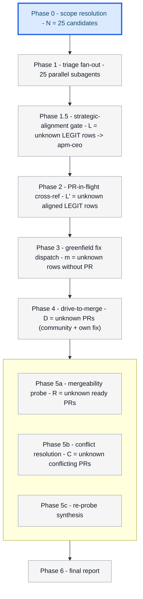
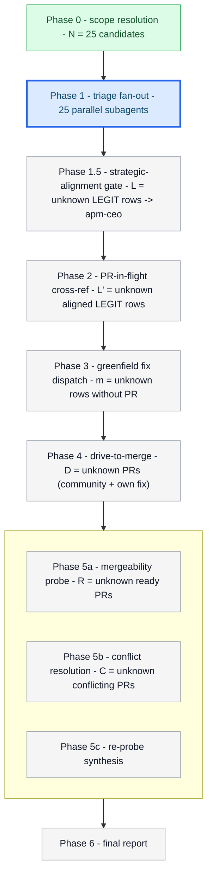
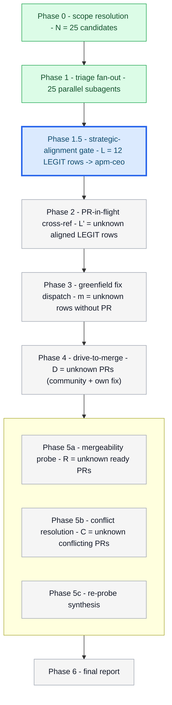
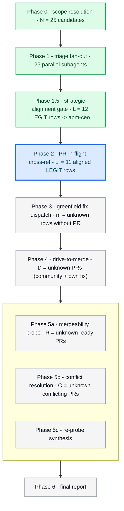
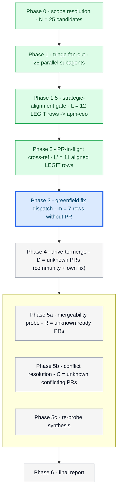
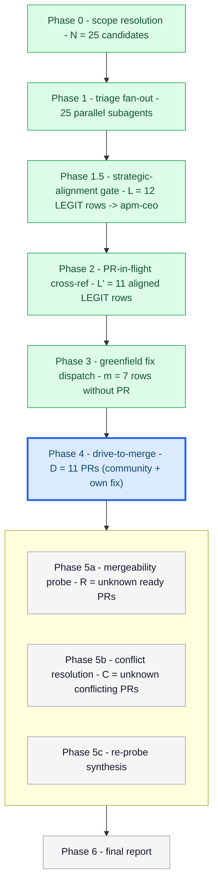
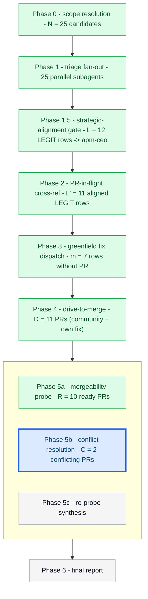
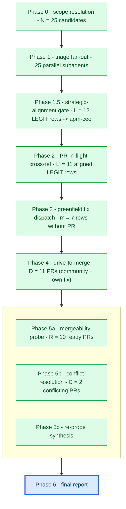

# Orchestrator session: with batch-bug-shepherd skill loaded

User: sweep the bug queue and drive whatever's mergeable to a
ready-to-ship state.

Orchestrator (activates batch-bug-shepherd skill by name; loads its
SKILL.md as the working spec, including the operator-visibility
contract in `assets/progress-diagram.md`, the Phase 1.5 strategic gate,
and the composed shepherd-driver drive wave).

## Progress (Phase 0 - scope resolution)



Running candidate enumeration:

```
gh issue list --label bug --state open --json number,title,labels,body
gh issue list --state open --search "is:open no:label" --json number,title,body
```

Resolved 25 candidates (22 bug-labeled + 3 untyped issues matching
suspicion keywords). Count exceeds the sweep-all threshold of 20.
ASKING FOR CONFIRMATION before fan-out:

> 25 candidates resolved. Plan: 25 parallel triage subagents ->
> strategic-alignment gate for LEGIT rows -> PR-in-flight cross-reference
> -> greenfield fix dispatch for rows without a PR -> shepherd-driver
> drive wave for community and own-fix PRs -> mergeability probe and
> conflict resolution -> final report. Disciplines: mutation-break,
> ASCII, lint contract, single-writer per PR, two-comment cap, bias
> toward folding. Ground-truth table will live in plan.md. Proceed?

User: confirmed.

Initializing ground-truth table (`assets/ground-truth-table.md`) with
25 rows:

| issue | verdict | pr | pr_in_flight | author | head_repo | head_branch | maintainer_can_modify | status | strategic_verdict | notes |
|-------|---------|----|---------------|--------|-----------|-------------|------------------------|--------|-------------------|-------|
| #281 | pending | | unknown | -- | -- | -- | unknown | pending-triage | -- | CLI traceback on missing apm.yml |
| #282 | pending | | unknown | -- | -- | -- | unknown | pending-triage | -- | install command ignores bad lockfile |
| ... | ... | ... | ... | ... | ... | ... | ... | ... | ... | 23 more rows, identical shape |

## Progress (Phase 1 - triage fan-out)



Reloading the ground-truth table at this phase boundary.

### Dispatch (Phase 1) -- 25 parallel subagents

| subagent_id | target | role |
|-------------|--------|------|
| triage-281 | issue #281 | reproduce on HEAD |
| triage-282 | issue #282 | reproduce on HEAD |
| ... | ... | 23 more triage rows |

Returns received: 12 LEGIT, 5 UNCLEAR, 8 FIXED-AT-HEAD. Table updated.

## Progress (Phase 1.5 - strategic-alignment gate)



Loading `references/strategic-alignment-gate.md`; probing apm-ceo and
PRINCIPLES.md before fan-out.

### Dispatch (Phase 1.5) -- 12 parallel subagents

| subagent_id | target | role |
|-------------|--------|------|
| ceo-align-281 | issue #281 | strategic alignment |
| ceo-align-282 | issue #282 | strategic alignment |
| ... | ... | 10 more alignment rows |

Returns: 11 aligned or aligned-with-reservations; 1 out-of-scope row
demoted to `triaged-deferred` and skipped downstream. Reservations are
stored for PANEL_PRIOR in Phase 4.

## Progress (Phase 2 - PR-in-flight cross-reference)



Reloading the table. Running enriched query for each aligned LEGIT row:

```
gh pr list --search "<issue-ref>" --state open --json number,title,headRefName,headRepository,headRepositoryOwner,author,maintainerCanModify
```

Four aligned LEGIT issues have in-flight community PRs; seven aligned
LEGIT issues do not. For each in-flight PR, the table captures
PR_NUMBER, AUTHOR, HEAD_REPO, HEAD_BRANCH, MAINTAINER_CAN_MODIFY, and
ORIGIN=community. The demoted row remains `triaged-deferred`.

## Progress (Phase 3 - greenfield fix fan-out)



### Dispatch (Phase 3) -- 7 parallel subagents

| subagent_id | target | role |
|-------------|--------|------|
| fix-281 | issue #281 | TDD fix, mutation-break gate, lint contract |
| fix-284 | issue #284 | TDD fix, mutation-break gate, lint contract |
| ... | ... | 5 more fix rows |

Reloading the ground-truth table. Each fix subagent writes the failing
test first, implements the minimum fix, proves the mutation-break gate,
runs `uv run --extra dev ruff check src/ tests/ && uv run --extra dev ruff format --check src/ tests/`,
and opens a PR under microsoft/apm. Returned PRs are stored with
ORIGIN=own-fix, HEAD_REPO=microsoft/apm, HEAD_BRANCH, AUTHOR, and
MAINTAINER_CAN_MODIFY=true.

## Progress (Phase 4 - drive-to-merge fan-out)



Probing `../shepherd-driver/assets/shepherd-driver-prompt.md` and
`../shepherd-driver/assets/completion-schema.json`; both present.
Drivers are dispatched in batches of three to bound nested panel fan-out.

### Dispatch (Phase 4) -- 11 parallel subagents

| subagent_id | target | role |
|-------------|--------|------|
| drive-1402 | PR #1402 | shepherd-driver loop for community PR |
| drive-1410 | PR #1410 | shepherd-driver loop for community PR |
| drive-1451 | PR #1451 | shepherd-driver loop for own-fix PR |
| ... | ... | 8 more drive rows |

Each driver receives PR_NUMBER, ISSUE_NUMBER, AUTHOR, HEAD_REPO,
HEAD_BRANCH, MAINTAINER_CAN_MODIFY, REPO_ROOT, ORIGIN, and optional
PANEL_PRIOR reservations. Each driver owns Copilot classification,
apm-review-panel, fold-vs-defer classification, pushes, CI watch, and
one advisory comment. The driver files genuinely separable deferred work
with `gh issue create --title "Defer separable follow-up from PR <n>"`;
close-call findings are folded into the PR.

Returns: 10 PRs return `completion_return.status = ready-to-merge` or
`advisory-with-deferred` with folded_items populated and
deferred_items linked to tracking issues; 1 PR stays blocked in the
driver session on flaky CI. Cross-session-message only on green.

Each driver ran the canonical-owner gate (Step X.2.5) and returned
`architecture_evidence` in its `completion_return` before any terminal
status:

- 3 PRs -> canonical-owner gate: architecture classification new-owner / split-authority-repair.
  Dual guardrail proven per PR: behavioral regression test + static boundary guard in scripts/lint-architecture-boundaries.sh + architecture assertion tests/integration/test_architecture_authorities.py, confirmed by mutation-break.
- 7 PRs -> canonical-owner gate: architecture classification ordinary-fix / not-applicable; no durable decision re-owned, so no dual guardrail; boundary lint clean.

Fail-closed rule honored: 1 driver with missing owner evidence cannot return ready-to-merge and stays blocked on the canonical-owner guardrail rather than deferring it.

## Progress (Phase 5 - mergeability gate)



Loading `../shepherd-driver/references/mergeability-gate.md`.
Sub-phase 5a probes every Phase-4 ready PR via:

```
gh pr view <pr> --json mergeStateStatus,mergeable,maintainerCanModify,headRepository,headRepositoryOwner,headRefName
```

Partition:

| PR | mergeStateStatus | route |
|----|------------------|-------|
| #1402 | CLEAN | verified-ready |
| #1410 | CLEAN | verified-ready |
| #1396 | DIRTY | 5b |
| #1441 | DIRTY | 5b |
| (6 more) | CLEAN | verified-ready |

C = 2 of 10. Dispatch table for sub-phase 5b:

### Dispatch (Phase 5b) -- 2 parallel subagents

| subagent_id | target | role |
|-------------|--------|------|
| resolve-conflicts-1396 | PR #1396 | rebase, resolve, push, re-probe |
| resolve-conflicts-1441 | PR #1441 | rebase, resolve, push, re-probe |

Sub-phase 5b returns: both `status: resolved`,
`mergeStateStatus_post: CLEAN`, push command examples include
`git push origin HEAD:fix/download-race --force-with-lease`, and each
posts one resolution-confirmation comment. This is the second and final
orchestrator-attributable comment per PR; the in-loop apm-review-panel
comment was rewritten idempotently by the driver and does not add to the
count.

Sub-phase 5c: orchestrator-side trust-but-verify re-probe agrees.
Four-way partition this run: 10 resolved, 0 requires-author-action, 0
requires-human-judgment, 0 resolution-failed.

## Progress (Phase 6 - final report)



Reading the final table; rendering `assets/final-report-template.md`:

- 10 ready-to-merge-verified (mergeStateStatus re-probed against current main; PR links + CI evidence; folded items per PR; deferred items linked to tracking issues).
- 0 requires-author-action.
- 0 requires-human-judgment.
- 0 resolution-failed.
- 1 still in-session (blocked on flaky CI from Phase 4).
- 1 strategically deferred (recommend close as out-of-scope, citing PRINCIPLES.md).
- 8 FIXED-AT-HEAD (recommend close).
- 5 UNCLEAR (surfaced for human triage with repro notes).

Single-writer interlock honored on every PR. Lint contract honored on
every push, including post-rebase pushes. Bias toward folding honored.
Mergeability gate honored: 2 PRs rebased and re-probed before the report
claimed them ready; bare force was never used (`--force-with-lease`
only). Two-comment cap honored: one driver advisory comment and, only
where Phase 5 resolved a conflict, one resolution-confirmation comment.
