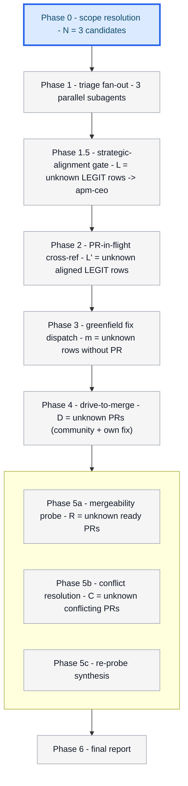
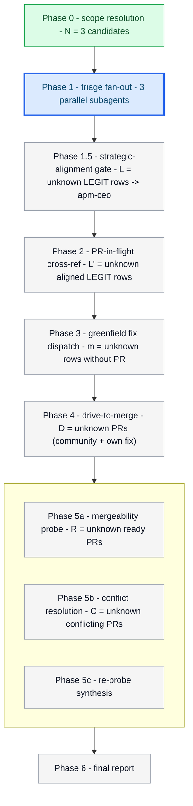
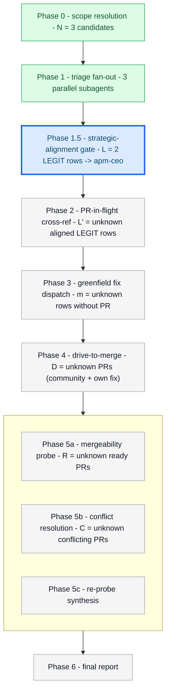
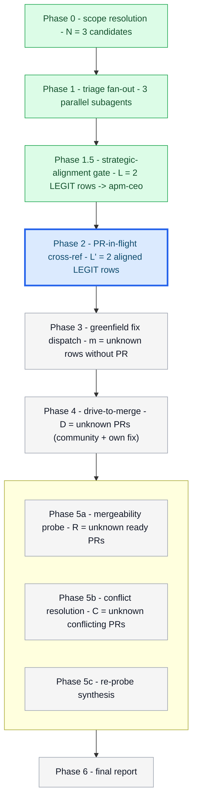
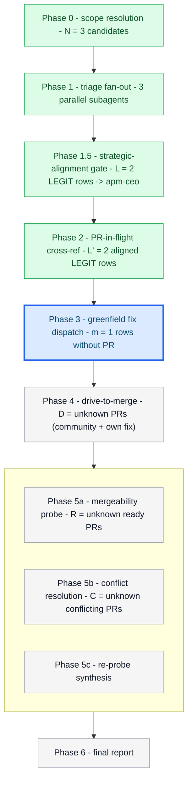
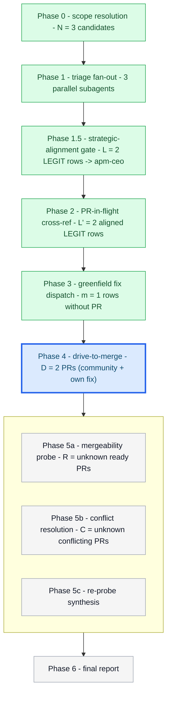
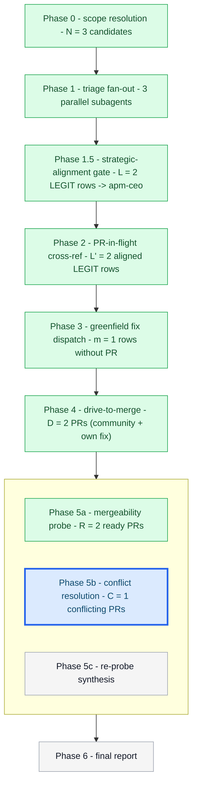
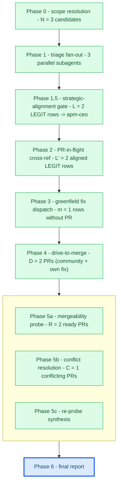

# Orchestrator session: with batch-bug-shepherd skill loaded

User: triage these bugs: #311 (CLI crash on empty config), #312
(auth: PAT lookup intermittent), #313 (deprecated --token-source
still in help text).

Orchestrator (activates batch-bug-shepherd skill by name; loads its
SKILL.md as the working spec, including the operator-visibility
contract in `assets/progress-diagram.md`, the strategic-alignment
Phase 1.5 gate, and the composition edge to
`../shepherd-driver/assets/shepherd-driver-prompt.md`).

## Progress (Phase 0 - scope resolution)



Three explicit issues, no sweep-all expansion needed. Below threshold
(20), proceeding without confirmation. Ground-truth table written to
plan.md and will be re-read at every phase boundary.

| issue | verdict | pr | pr_in_flight | author | head_repo | head_branch | maintainer_can_modify | status | strategic_verdict | notes |
|-------|---------|----|---------------|--------|-----------|-------------|------------------------|--------|-------------------|-------|
| #311 | pending | | unknown | -- | -- | -- | unknown | pending-triage | -- | CLI crash on empty config |
| #312 | pending | | unknown | -- | -- | -- | unknown | pending-triage | -- | auth PAT lookup intermittent |
| #313 | pending | | unknown | -- | -- | -- | unknown | pending-triage | -- | deprecated --token-source help text |

## Progress (Phase 1 - triage fan-out)



Reloading the ground-truth table from plan.md before fan-out.

### Dispatch (Phase 1) -- 3 parallel subagents

| subagent_id | target | role |
|-------------|--------|------|
| triage-311 | issue #311 | reproduce on HEAD |
| triage-312 | issue #312 | reproduce on HEAD |
| triage-313 | issue #313 | reproduce on HEAD |

Returns (validated against `assets/verdict-schema.json`):
- #311 -> LEGIT (reproduced via `apm init --config /dev/null`).
- #312 -> LEGIT (reproduced intermittently; race in AuthResolver cache).
- #313 -> FIXED-AT-HEAD; recommend close referencing #1402.

Table updated in plan.md.

## Progress (Phase 1.5 - strategic-alignment gate)



Loading `references/strategic-alignment-gate.md`; probing
`.apm/agents/apm-ceo.agent.md` and `PRINCIPLES.md` before dispatch.

### Dispatch (Phase 1.5) -- 2 parallel subagents

| subagent_id | target | role |
|-------------|--------|------|
| ceo-align-311 | issue #311 | strategic alignment |
| ceo-align-312 | issue #312 | strategic alignment |

Returns:
- #311 -> aligned; crash on empty config violates the reliability promise.
- #312 -> aligned-with-reservations; PAT cache work must avoid widening token scope.

#313 is FIXED-AT-HEAD and skips downstream work. No row is demoted to
`triaged-deferred`; reservations for #312 become PANEL_PRIOR input for
its driver.

## Progress (Phase 2 - PR-in-flight cross-reference)



Running enriched PR probes for aligned LEGIT rows:

```
gh pr list --search "#311" --state open --json number,title,headRefName,headRepository,headRepositoryOwner,author,maintainerCanModify
gh pr list --search "#312" --state open --json number,title,headRefName,headRepository,headRepositoryOwner,author,maintainerCanModify
```

Results:
- #311 -> no in-flight PR; route to Phase 3 greenfield fix.
- #312 -> PR #1428 in flight; capture AUTHOR=contoso,
  HEAD_REPO=contoso/apm, HEAD_BRANCH=fix/auth-cache-race,
  MAINTAINER_CAN_MODIFY=true, ORIGIN=community.

Table updated. Phase 2 complete before any fix or drive spawn.

## Progress (Phase 3 - greenfield fix fan-out)



### Dispatch (Phase 3) -- 1 parallel subagents

| subagent_id | target | role |
|-------------|--------|------|
| fix-311 | issue #311 | TDD fix, mutation-break gate, lint contract |

`fix-311` returns: PR #1437 opened under microsoft/apm, branch
`fix-empty-config-crash`, failing test written first, mutation-break
gate honored (guard removed -> test FAILS), and lint contract silent:
`uv run --extra dev ruff check src/ tests/ && uv run --extra dev ruff format --check src/ tests/`.

The row is enriched for the driver: AUTHOR=maintainer,
HEAD_REPO=microsoft/apm, HEAD_BRANCH=fix-empty-config-crash,
MAINTAINER_CAN_MODIFY=true, ORIGIN=own-fix.

## Progress (Phase 4 - drive-to-merge fan-out)



Probing sibling driver assets and schema:

```
test -f ../shepherd-driver/assets/shepherd-driver-prompt.md && test -f ../shepherd-driver/assets/completion-schema.json
```

### Dispatch (Phase 4) -- 2 parallel subagents

| subagent_id | target | role |
|-------------|--------|------|
| drive-1428 | PR #1428 | shepherd-driver loop for community PR |
| drive-1437 | PR #1437 | shepherd-driver loop for own-fix PR |

Each `drive-<pr>` subagent receives PR_NUMBER, ISSUE_NUMBER, AUTHOR,
HEAD_REPO, HEAD_BRANCH, MAINTAINER_CAN_MODIFY, REPO_ROOT, ORIGIN, and
for PR #1428 the PANEL_PRIOR reservations from Phase 1.5. The driver
owns Copilot classification, apm-review-panel, fold-vs-defer, push, CI
watch, and the single advisory comment. The orchestrator only validates
`completion_return` against `../shepherd-driver/assets/completion-schema.json`,
updates the table, and removes `status/shepherding`.

Driver returns:
- drive-1428 -> `completion_return.status = advisory-with-deferred`;
  folded_items: regression test and AuthResolver helper extraction;
  deferred_items: one separable CLI flag rename filed by the driver
  with `gh issue create --title "Defer broad flag rename from PR #1428"`.
- drive-1437 -> `completion_return.status = ready-to-merge`; no deferred
  work. CI green.

Cross-session-message only on green; failures would stay in the driver
session. The orchestrator never posts to a PR directly.

## Progress (Phase 5 - mergeability gate)



Loading `../shepherd-driver/references/mergeability-gate.md`.
Sub-phase 5a probes every ready PR with:

```
gh pr view 1428 --json mergeStateStatus,mergeable,maintainerCanModify,headRepository,headRepositoryOwner,headRefName
gh pr view 1437 --json mergeStateStatus,mergeable,maintainerCanModify,headRepository,headRepositoryOwner,headRefName
```

Partition:

| PR | mergeStateStatus | route |
|----|------------------|-------|
| #1428 | DIRTY | 5b |
| #1437 | CLEAN | verified-ready |

### Dispatch (Phase 5b) -- 1 parallel subagents

| subagent_id | target | role |
|-------------|--------|------|
| resolve-conflicts-1428 | PR #1428 | rebase, resolve, push, re-probe |

`resolve-conflicts-1428` uses
`../shepherd-driver/assets/conflict-resolution-prompt.md`, rebases onto
main, resolves faithfully, runs lint, and pushes with
`git push origin HEAD:fix/auth-cache-race --force-with-lease`. It then
re-probes and posts the resolution-confirmation comment, the second and
final orchestrator-attributable comment for that PR.

Sub-phase 5c trust-but-verify re-probe agrees. Four-way partition: 1
resolved, 0 requires-author-action, 0 requires-human-judgment, 0
resolution-failed.

## Progress (Phase 6 - final report)



Reading the final table; rendering `assets/final-report-template.md`:

- #311: LEGIT; PR #1437 (own-fix); status ready-to-merge-verified.
- #312: LEGIT; PR #1428 (community); status ready-to-merge-verified;
  2 follow-ups folded, 1 genuinely separable item deferred to tracking
  issue by the driver.
- #313: FIXED-AT-HEAD; recommend close referencing #1402.

Two-comment cap honored: the driver advisory comment at drive-wave
terminal plus the conflict-resolution confirmation comment when Phase 5
resolved #1428. The in-loop apm-review-panel comment was rewritten by
the driver and did not add to the count. Single-writer interlock,
mutation-break, lint contract, mergeStateStatus re-probe, and bias
toward folding were all honored.
