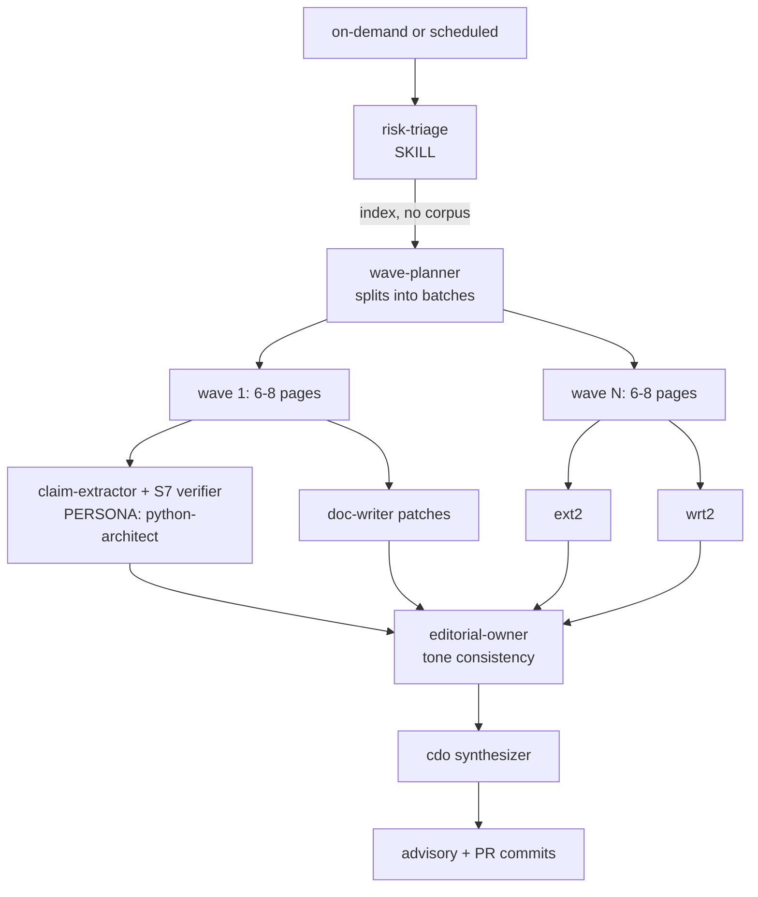

# docs-corpus-audit (sibling skill to docs-sync)

## Genesis verdict

docs-sync **cannot absorb** full-corpus regrounding. Reasons:

| | docs-sync | docs-corpus-audit (proposed) |
|---|---|---|
| Trigger | per-PR event | scheduled / on-demand |
| Input | PR diff (bounded) | full corpus (112 pages, 21k lines) |
| Cost ceiling | 15 LLM calls / run | bounded by wave size, not flat |
| Topology | classifier -> localizer -> 1 fan-out | triage -> wave-batched PANEL with WAVE EXECUTION |
| Question | "what changed?" | "what's still true?" |

## Component shape (step 2)

## Patterns applied

- A1 PANEL (fan-out across pages)
- WAVE EXECUTION (batches; not all 112 pages in parallel)
- S7 DETERMINISTIC TOOL BRIDGE (apm --help, grep src/, python -c)
- A9 SUPERVISED EXECUTION (probe -> verify -> apply)
- B4 PLAN MEMENTO (this file)

## Reuse from docs-sync agent roster

- doc-writer (patches)
- python-architect (S7 verifier)
- editorial-owner (tone pass)
- cdo (synthesis)

## NEW capability needed

- claim-extractor: for a given page, return a list of verifiable factual claims (CLI flags, env vars, schema fields, file paths, behaviors). Cheap one-shot prompt; no new persona.

## Execution path this session

Bounded scope (high-drift-risk pages only):

| Tier | Pages | Reason |
|---|---:|---|
| reference/cli/* | 28 | CLI surface; cited flag/help text drifts every release |
| reference/schemas | 9 | lockfile, manifest, policy, primitives, baseline |
| consumer/* | 12 | install/auth/run flows |
| getting-started/* + quickstart + index | 6 | onboarding truth |
| **Total in-scope** | **55** | High-risk |
| producer/* | 16 | DEFER (mostly process, low drift risk) |
| enterprise/* | 14 | DEFER except policy-reference (in tier above) |
| concepts/* | 7 | DEFER (definitional, slow-drift) |
| contributing/, troubleshooting/, etc | 20 | DEFER |

## Wave plan

6 parallel agents, ~9 pages each:

| Wave | Agent | Pages |
|---|---|---|
| 1 | cli-A | audit, cache, compile, config, deps, experimental, init, install, list |
| 1 | cli-B | marketplace, mcp, outdated, pack, plugin, policy, preview, prune, publish |
| 1 | cli-C | run, runtime, search, self-update, targets, uninstall, unpack, update, view |
| 1 | schemas | environment-variables, experimental, lockfile-spec, manifest-schema, policy-schema, primitive-types, package-types, baseline-checks, targets-matrix, registry-http-api |
| 2 | consumer | all 12 consumer/ pages |
| 2 | onboarding | quickstart.mdx, index.mdx, getting-started/*.md (5 files) |

Each agent:
1. Reads its pages
2. Extracts factual claims (CLI flag, env var, file path, schema field, behavior assertion)
3. S7 verifies each claim: run `uv run apm <verb> --help`, `grep -n <symbol> src/apm_cli/`, `python -c "from apm_cli... import ..."`, etc.
4. For drift detected: applies surgical edit via edit tool (single-writer per page; no cross-page conflicts because page assignments are disjoint)
5. Returns JSON: per-page {claims_total, grounded, drifted, fixed, unverifiable}

Then: editorial pass on changed pages, CDO synthesis, commit + push to PR #1511.

## Future: extract as actual skill

When the maintainer wants this scheduled (quarterly / pre-release), extract:
- `.apm/skills/docs-corpus-audit/SKILL.md` with the body above
- Inherit doc-sync's agent roster
- Add `.github/workflows/docs-corpus-audit.yml` with schedule cron
- Evals: ~3 content evals (a corpus with known drift; verify the audit catches it).
