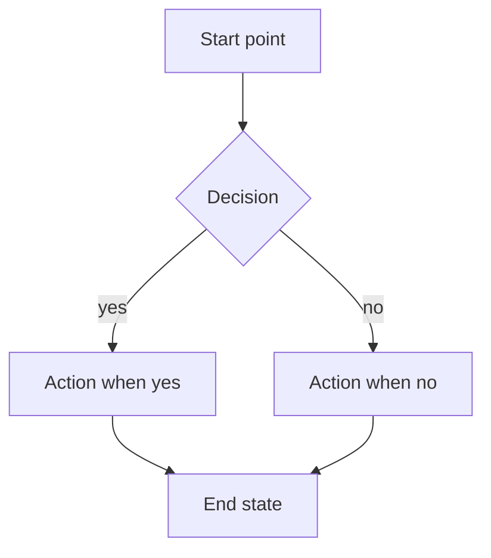
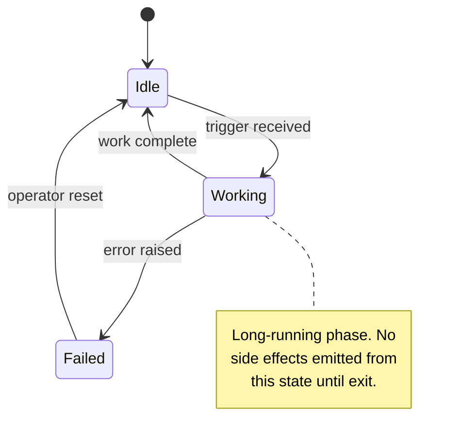

<!--
  pr-body-template.md

  Loaded by pr-description-skill ONLY at synthesis time, after every
  row of the activation contract has been filled. Do not load this
  file during persona dispatch or planning. Replace every <PLACEHOLDER>
  with content drawn ONLY from the activation contract inputs.

  ASCII-only. No emojis, no em dashes, no curly quotes, no box-
  drawing characters. Every mermaid node and edge label is ASCII.
-->

# <verb>(<scope>): <one-line imperative summary>
<!-- check: first line is at most 100 chars; verb is imperative (add, fix, refactor, harden, document, ship); scope matches the area touched (e.g. cli, install, integration, docs, ci, skills) -->

## TL;DR
<!-- check: at most 4 sentences; states what changed, why, and the eliminated risk; no marketing language -->

<PARAGRAPH: what changed, why now, the risk this eliminates. Keep it
to four sentences max.>

## Problem (WHY)
<!-- check: at least 2 verbatim quoted anchors with hyperlinks; each observed failure tagged with [x] for hard violation or [!] for soft risk -->

We observed:

- `[x]` <Concrete failure mode 1, with file or command evidence.>
- `[x]` <Concrete failure mode 2.>
- `[!]` <Soft risk or drift vector observed in the codebase today.>

Why each is a violation:

- <Failure 1> violates
  ["<verbatim quote from PROSE or Agent Skills>"](<source url>).
- <Failure 2> violates
  ["<verbatim quote>"](<source url>).
- <Soft risk> would over time degrade
  ["<verbatim quote>"](<source url>).

## Approach (WHAT)
<!-- check: every row has a Principle column AND a Source column; principles are quoted verbatim, not paraphrased -->

| # | Fix | Principle operationalized | Source |
|---|-----|---------------------------|--------|
| 1 | <Surgical fix description.> | ["<verbatim quote>"](<source url>) | <PROSE -- Constraint Name OR Agent Skills -- Section Name> |
| 2 | <Surgical fix description.> | ["<verbatim quote>"](<source url>) | <Source> |
| 3 | <Surgical fix description.> | ["<verbatim quote>"](<source url>) | <Source> |

## Implementation (HOW)
<!-- check: every named file has its own H3 subsection; every subsection has at least one quoted anchor; no line-by-line restatement of the diff -->

### `<path/to/file/1>`

- <Intent of the change in this file.>
- <Risk this introduces or eliminates.>
- <Anchor:> per
  ["<verbatim quote>"](<source url>).

### `<path/to/file/2>`

- <Intent of the change.>
- <Surgical scope note: what was deliberately NOT touched in this
  file and why.>

## Diagrams
<!-- check: at least one diagram for any non-doc-only PR; every label is ASCII; at least one note or legend; verify the rendered output before saving -->

### 1. <Short diagram title>



Legend: <one-line ASCII legend describing the boxes / arrows>.

### 2. <Short diagram title>



## PROSE alignment matrix (honest)
<!-- check: any score < 5 has a one-sentence "why not 5"; any 5 has explicit justification; an all-5 column without justification is refused as inflation -->

| PROSE dimension | Before this PR | After this PR | Honest score 1-5 |
|-----------------|----------------|---------------|------------------|
| Progressive Disclosure | <Before state.> | <After state.> | <N> |
| Reduced Scope | <Before.> | <After.> | <N> |
| Orchestrated Composition | <Before.> | <After.> | <N> |
| Safety Boundaries | <Before.> | <After.> | <N> |
| Explicit Hierarchy | <Before.> | <After.> | <N> |

We knowingly leave <dimension X> at <score> because <one-sentence
honest reason naming what is still missing>. A follow-up PR will
<one-line plan or "this is acceptable residual scope">.

## Trade-offs and self-critique
<!-- check: at least one rejected option per non-trivial decision; rationale grounded in a quote when possible; surgical-scope decisions explicitly listed -->

- **<Decision 1 in one phrase>.** Option chosen: <option>. Option
  rejected: <option>. Rationale: <why, ideally grounded in a quoted
  principle>. Anchor:
  ["<verbatim quote>"](<source url>).

- **<Decision 2>.** Option chosen: <option>. Option rejected:
  <option>. Rationale: <why>.

- **Pre-existing issue X left in place.** Option chosen: leave it.
  Option rejected: opportunistically fix. Rationale: surgical scope;
  the right venue is a separate PR.

## Benefits (recap)
<!-- check: numbered, concrete, no adjectives like "great", "amazing", "significantly"; each benefit names a measurable or observable change -->

1. <Concrete benefit, e.g. "One comment per PR review run instead of
   N comments".>
2. <Concrete benefit, named in terms a reviewer can verify.>
3. <Concrete benefit.>

## Validation
<!-- check: at least one fenced block of real CLI output; commands actually executed, not invented; ASCII purity confirmed -->

`<command run, e.g. apm audit --ci>`:

```
<verbatim CLI output, ASCII only, no decoration>
```

ASCII purity (printable U+0020-U+007E, plus newline and tab) across
the authored / rewritten files:

- `<path/to/file/1>` -- OK
- `<path/to/file/2>` -- OK

`<other validation, e.g. uv run pytest tests/unit/...>`:

```
<verbatim test output excerpt; the relevant pass/fail lines>
```

## How to test
<!-- check: every step is independently runnable; no "see the diff"; reviewer can follow these steps without reading the source -->

1. <Concrete reproducible step the reviewer runs first.>
2. <Next step, with the expected observable outcome.>
3. <Next step.>
4. <Final assertion the reviewer makes against observed output.>

Co-authored-by: Copilot <223556219+Copilot@users.noreply.github.com>
