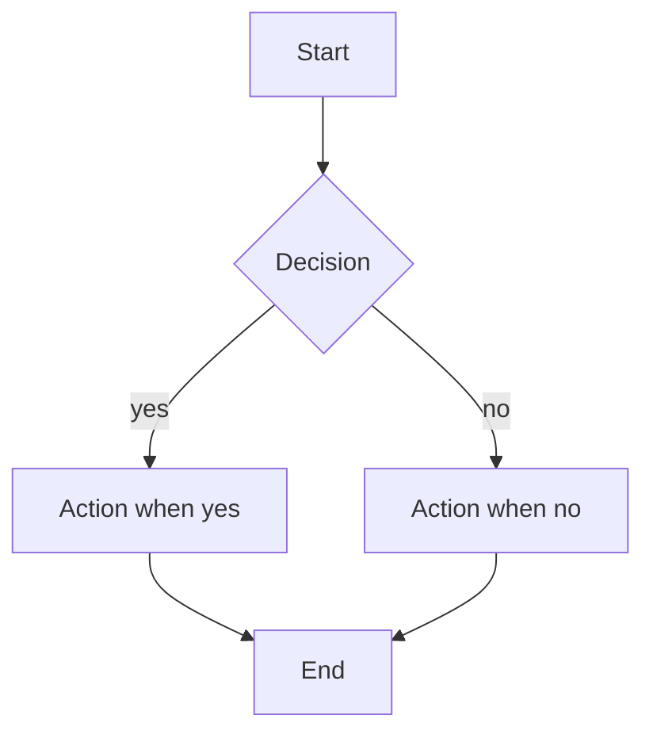

<!--
  pr-body-template.md

  Loaded by pr-description-skill ONLY at synthesis time, after every
  row of the activation contract has been filled. Replace every
  <PLACEHOLDER> with content drawn from the activation contract
  inputs. Drop a section's body (keep its header) only when SKILL.md
  explicitly allows it for this PR shape.

  CHARSET: this template is ASCII because it lives in the repo and is
  subject to .github/instructions/encoding.instructions.md. The
  rendered PR body the orchestrator produces from this template MUST
  be UTF-8 GitHub-Flavored Markdown -- use em dashes, smart quotes,
  alerts, collapsibles, and Unicode where they improve readability.
-->

# <verb>(<scope>): <one-line imperative summary>

## TL;DR

<2-4 sentences: what changed, why now, the risk this eliminates.>

> [!NOTE]
> <Optional one-line callout: linked issue, follow-up plan, or the
> single fact a reviewer most needs to know up front.>

## Problem (WHY)

<Up to 6 bullets. Tag each with [x] hard violation or [!] soft risk.
Up to 3 verbatim quoted anchors total across this section.>

- [x] <Concrete failure mode 1, with file or command evidence.>
- [x] <Concrete failure mode 2.>
- [!] <Soft risk or drift vector observed today.>

Why these matter: <Failure 1> violates
["<verbatim quote from PROSE or Agent Skills>"](<source url>);
<Failure 2> violates
["<verbatim quote>"](<source url>).

## Approach (WHAT)

<Table OR 3-7 bullets. If purely additive, replace this section's
body with: "Additive change -- see Implementation.">

| # | Fix | Principle | Source |
|---|-----|-----------|--------|
| 1 | <Surgical fix.> | ["<verbatim quote>"](<url>) | <PROSE / Agent Skills section> |
| 2 | <Surgical fix.> | ["<verbatim quote>"](<url>) | <Source> |
| 3 | <Surgical fix.> | ["<verbatim quote>"](<url>) | <Source> |

## Implementation (HOW)

<One short paragraph per file changed, OR a table. No prose walls.
Permalink to the diff for line-level evidence:
https://github.com/microsoft/apm/blob/<sha>/path#L12-L34>

- **`<path/to/file/1>`** -- <intent in one or two sentences;
  what was deliberately not touched and why.>
- **`<path/to/file/2>`** -- <intent; anchor if non-mechanical:
  per ["<quote>"](<url>).>

## Diagrams

<1-3 mermaid blocks. Each preceded by a one-sentence legend. Every
block MUST have been validated by mmdc before saving.>

Legend: <one sentence on what this diagram shows and what to look
at first>.



<Add a second diagram only if the relationships are non-trivial.>

## Trade-offs

<3-5 bullets. 1-2 acceptable for mechanical PRs.>

- **<Decision in one phrase>.** Chose <option>; rejected <option>
  because <rationale, ideally anchored:
  ["<quote>"](<url>)>.
- **Pre-existing issue X left in place.** Surgical scope; right
  venue is a separate PR.

## Benefits

<3-5 numbered, measurable items.>

1. <Benefit a reviewer can verify, e.g. "One PR comment per review
   run instead of N".>
2. <Measurable benefit.>
3. <Measurable benefit.>

## Validation

<Real CLI output, verbatim. Long transcripts go in <details>.>

`apm audit --ci`:

```
<verbatim CLI output>
```

<details><summary>Full pytest output (N tests)</summary>

```
<verbatim transcript>
```

</details>

## How to test

<Max 5 numbered or task-list steps. Each step has an action and an
expected observation.>

- [ ] <Step 1: action -> expected observation.>
- [ ] <Step 2.>
- [ ] <Step 3.>

Co-authored-by: Copilot <223556219+Copilot@users.noreply.github.com>
