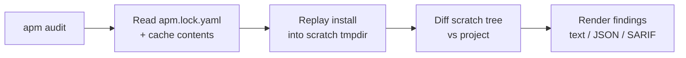

`apm audit` runs **drift detection by default** so a stale working tree
cannot ship to production unnoticed. This page explains what drift means,
how the check works, and the escape hatch when you need to disable it.

## What is integration drift?

Integration drift is any divergence between what `apm install` would
deploy from your locked dependencies and what is actually on disk.
Three kinds matter:

| Kind | Meaning | Typical cause |
|---|---|---|
| `unintegrated` | A `.apm/` source file is committed but its deployed counterpart is missing | Forgot to re-run `apm install` after adding/editing local primitives |
| `modified` | A deployed file's content differs from what install would produce | Hand-edit to a regenerated file under `.github/`, `.claude/`, `.cursor/`, etc. |
| `orphaned` | A deployed file exists with no current source backing it | Removed a dependency or local primitive without re-running install |

All three previously required ad-hoc `git status --porcelain` scripts in
CI to detect. With drift detection, `apm audit` catches every case in
one read-only command -- nothing in your project, lockfile, or
`apm_modules/` is mutated.

## How it works



The replay is **cache-only** -- no network, no git fetch, no MCP
registry call. It will fail fast with `CacheMissError` if the lockfile
references content not present in the persistent cache (run
`apm install` once first).

False-positive guards normalize:

- Build-ID lines (e.g. APM-generated `<!-- Build ID: ... -->` markers).
- CRLF -> LF line endings (Windows checkouts of LF-canonical sources).
- UTF-8 BOM byte-order marks.

## Default behaviour and exit codes

| Mode | Drift findings | Exit code |
|---|---|---|
| `apm audit` | Reported in stdout | 0 (advisory only) |
| `apm audit --ci` | Reported and counted as failure | 1 |
| `apm audit --no-drift` | Skipped entirely | governed only by other checks |

In `--ci` mode drift findings are pooled with the seven baseline lockfile
checks (`lockfile-exists`, `ref-consistency`, etc.) -- a single
non-zero exit covers all of them.

## When to use `--no-drift`

The escape hatch exists for three legitimate cases:

1. **Tight inner loops** where you intentionally have local edits and
   just want a content-only safety scan (`apm audit --no-drift -v`).
2. **Strip-mode invocations** -- `--strip` and `--file` operate on a
   single payload and are mutually exclusive with `--no-drift` enforcement.
3. **Performance budgets** in matrix CI where you've already covered
   drift in a single non-matrix job upstream.

`--no-drift` is mutually exclusive with `--strip` and `--file` (the CLI
rejects the combination with a usage error rather than silently picking
one).

## Output formats

**Text (TTY default)** -- color-coded, one finding per line, grouped by kind.

**JSON** -- the audit report gains a top-level `drift` key:

```json
{
  "report_format_version": "1.0",
  "checks": [...],
  "drift": [
    {
      "path": ".github/instructions/foo.md",
      "kind": "modified",
      "package": "<local>",
      "inline_diff": "..."
    }
  ]
}
```

**SARIF** -- findings are appended to `runs[0].results` with rule IDs
`apm/drift/modified`, `apm/drift/unintegrated`, `apm/drift/orphaned`,
ready to surface in GitHub code-scanning.

## CI integration

The recommended CI gate is now a single line:

```yaml
- run: apm audit --ci
```

This subsumes the legacy bash workaround:

```yaml
# Legacy -- no longer needed once apm-action ships with drift support
- run: |
    if [ -n "$(git status --porcelain -- .github/ .claude/ .cursor/)" ]; then
      exit 1
    fi
```

For org-policy enforcement, combine with `--policy org` -- drift
detection composes orthogonally with the 17 audit-only policy checks.

See also: [CI Policy Enforcement](../ci-policy-setup/),
[Governance Guide](../../enterprise/governance-guide/).
