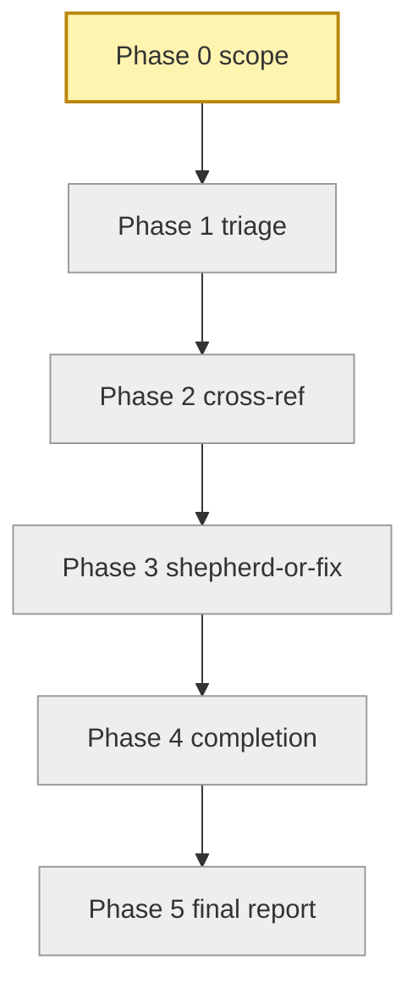
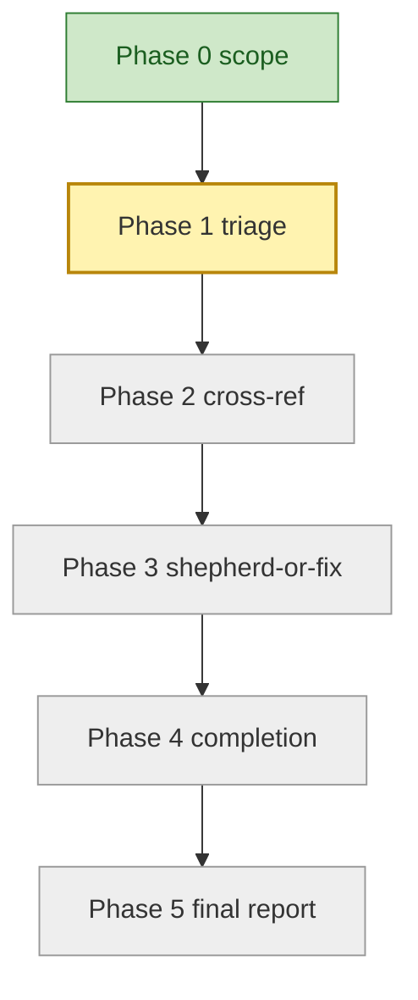
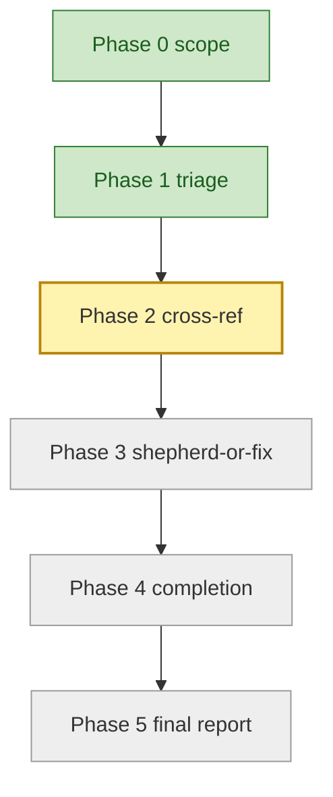
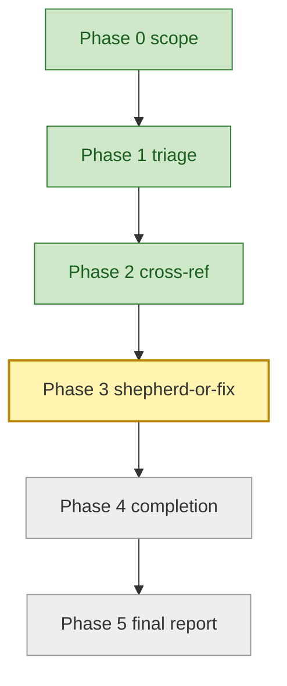
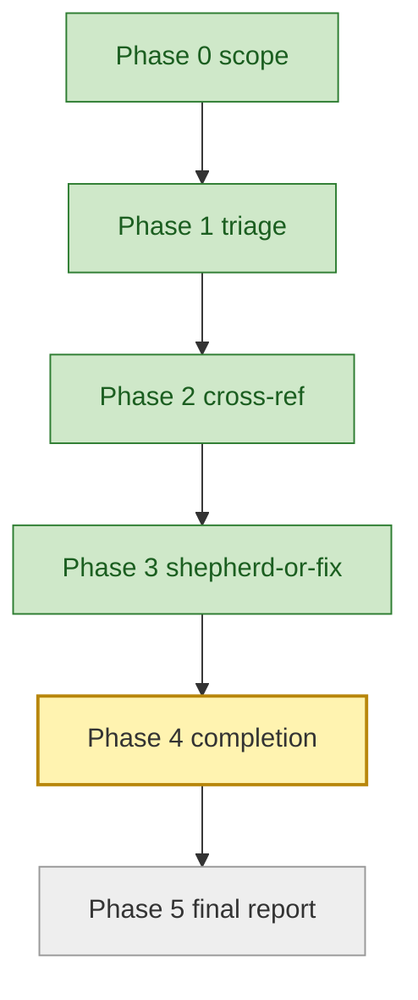
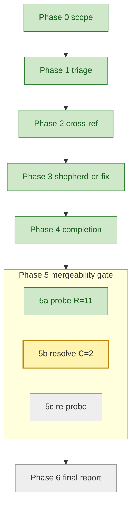
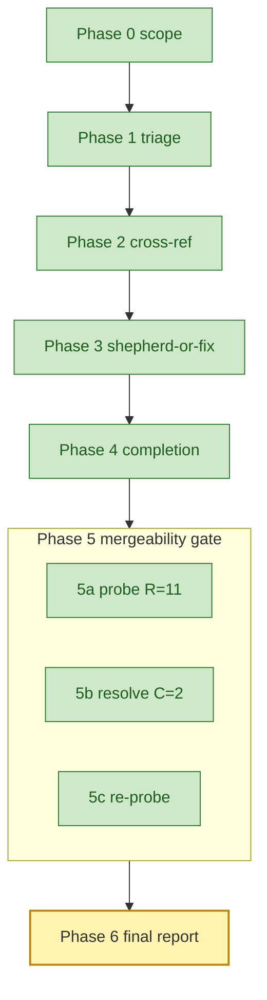

# Orchestrator session: with batch-bug-shepherd skill loaded

User: sweep the bug queue and drive whatever's mergeable to a
ready-to-ship state.

Orchestrator (activates batch-bug-shepherd skill by name; loads its
SKILL.md as the working spec, including the operator-visibility
contract in `assets/progress-diagram.md` and the bias-toward-folding
invariant covering `recommended_followups[]`).

## Progress (Phase 0 - scope resolution)



Running candidate enumeration:

```
gh issue list --label bug --state open --json number,title,labels,body
gh issue list --state open --search "is:open no:label" \
  --json number,title,body
```

Resolved 25 candidates (22 bug-labeled + 3 untyped issues matching
suspicion keywords).

Count exceeds the sweep-all threshold of 20. ASKING FOR
CONFIRMATION before fan-out:

> 25 candidates resolved. Plan: 25 parallel triage subagents ->
> cross-reference open PRs for every LEGIT row -> shepherd-or-fix
> fan-out -> completion fan-out (with FOLD/DEFER classification of
> recommended_followups) -> final report. Disciplines:
> mutation-break, ASCII, lint contract, single-writer per PR
> comment, bias toward folding. Ground-truth table will live in
> plan.md. Proceed?

User: confirmed.

Initializing ground-truth table (`assets/ground-truth-table.md`)
with 25 rows:

| issue | verdict | pr | pr_in_flight | author | status | notes |
|-------|---------|----|----|--------|--------|-------|
| #281  | pending |    | unknown | -- | pending-triage | CLI traceback on missing apm.yml |

(24 more rows, identical shape)

## Progress (Phase 1 - triage fan-out)



Dispatch table (25 parallel triage subagents via runtime `task`
affordance, each loading `assets/triage-prompt.md`):

| subagent_id | target | persona       | brief                              |
|-------------|--------|---------------|------------------------------------|
| triage-281  | #281   | triage-prompt | Reproduce missing-apm.yml traceback |
| triage-282  | #282   | triage-prompt | ...                                |
| ...         | ...    | ...           | (23 more rows, identical shape)    |

Reloading the ground-truth table at this phase boundary.

Returns received: 12 LEGIT, 5 UNCLEAR, 8 FIXED-AT-HEAD. Table
updated.

## Progress (Phase 2 - cross-reference)



Running `gh pr list --search "<issue-ref>" --state open` for each
of the 12 LEGIT rows. 4 LEGIT issues have in-flight community
PRs; 8 LEGIT issues do NOT. Table updated.

## Progress (Phase 3 - shepherd-or-fix fan-out)



Dispatch table (12 spawns, two sub-waves running in parallel):

| subagent_id     | target | persona         | brief                                                                                    |
|-----------------|--------|-----------------|------------------------------------------------------------------------------------------|
| shepherd-1402   | PR #1402 | shepherd-prompt | Activate apm-review-panel; return verdict + blocking_followups + recommended_followups |
| shepherd-1410   | PR #1410 | shepherd-prompt | (same)                                                                                  |
| ...             | ...    | shepherd-prompt | (2 more shepherd rows)                                                                  |
| fix-281         | #281   | fix-prompt      | TDD fix; mutation-break + lint contract                                                 |
| ...             | ...    | fix-prompt      | (7 more fix rows)                                                                       |

Reloading the ground-truth table.

Sub-wave 3a (SHEPHERD): 4 spawns return. All 4 verdicts
`ready-to-merge`; combined blocking_followups [] (0); combined
recommended_followups [11 items] each tagged with `source_persona`
and `fold_hint`.

Sub-wave 3b (FIX): 8 spawns. Each writes the failing test FIRST,
runs the mutation-break gate, runs the lint contract
(`ruff check src/ tests/` and `ruff format --check src/ tests/`
both silent), and opens a PR.

## Progress (Phase 4 - completion fan-out)



Dispatch table (12 completion subagents, one per PR):

| subagent_id     | target   | persona           | brief                                                                                 |
|-----------------|----------|-------------------|---------------------------------------------------------------------------------------|
| completion-1402 | PR #1402 | completion-prompt | RECOMMENDED_FOLLOWUPS=3; classify FOLD vs DEFER; fold legit items; `gh issue create` for DEFER |
| completion-1410 | PR #1410 | completion-prompt | (same shape)                                                                          |
| ...             | ...      | completion-prompt | (10 more completion rows)                                                             |

Reloading the ground-truth table.

Returns: 11 PRs land status `ready-to-merge` with folded_followups
populated and deferred_followups filed as tracking issues; 1 PR
stays in-session blocked on flaky CI. Cross-session-message ONLY
on green; failures stay in-session.

## Progress (Phase 5 - mergeability gate)



Loading `references/mergeability-gate.md` (load trigger: entering
Phase 5).

Sub-phase 5a probes every Phase-4 ready PR via `gh pr view
<pr> --json mergeStateStatus,mergeable,maintainerCanModify,
headRepository,headRepositoryOwner,headRefName` (S7 DETERMINISTIC
TOOL BRIDGE; never asserted from recall). Partition:

| PR    | mergeStateStatus | route          |
|-------|------------------|----------------|
| #1402 | CLEAN            | verified-ready |
| #1410 | CLEAN            | verified-ready |
| #1396 | DIRTY            | 5b             |
| #1441 | DIRTY            | 5b             |
| (7 more) | CLEAN         | verified-ready |

C = 2 of 11. Dispatch table for sub-wave 5b:

| subagent_id            | target   | persona                     | brief                                                                                |
|------------------------|----------|-----------------------------|--------------------------------------------------------------------------------------|
| resolve-conflicts-1396 | PR #1396 | conflict-resolution-prompt  | Rebase onto main; resolve faithfully; lint; push --force-with-lease; re-probe        |
| resolve-conflicts-1441 | PR #1441 | conflict-resolution-prompt  | (same shape)                                                                         |

Sub-wave 5b returns: both `status: resolved`,
`mergeStateStatus_post: CLEAN`, push_command containing
`--force-with-lease`, resolution-confirmation comment posted (the
second-and-final comment per the two-comment cap).

Sub-phase 5c: orchestrator-side trust-but-verify re-probe agrees.
Four-way partition this run: 11 resolved, 0
requires-author-action, 0 requires-human-judgment, 0
resolution-failed.

## Progress (Phase 6 - final report)



Reading the final table; rendering `assets/final-report-template.md`:

- 11 ready-to-merge (verified MERGEABLE against current main at
  the post-5c probe SHA; PR links + CI evidence; folded items per
  PR; deferred items linked to tracking issues)
- 0 requires-author-action
- 0 requires-human-judgment
- 0 resolution-failed
- 1 still in-session (blocked on flaky CI from Phase 4)
- 8 FIXED-AT-HEAD (recommend close)
- 5 UNCLEAR (surfaced for human triage with repro notes)

Single-writer interlock honored on every PR. Lint contract honored
on every push, including the post-rebase pushes. Bias toward
folding honored. Mergeability gate honored: 2 PRs rebased and
re-probed before the report claimed them ready; bare `--force` was
never used (`--force-with-lease` only).
