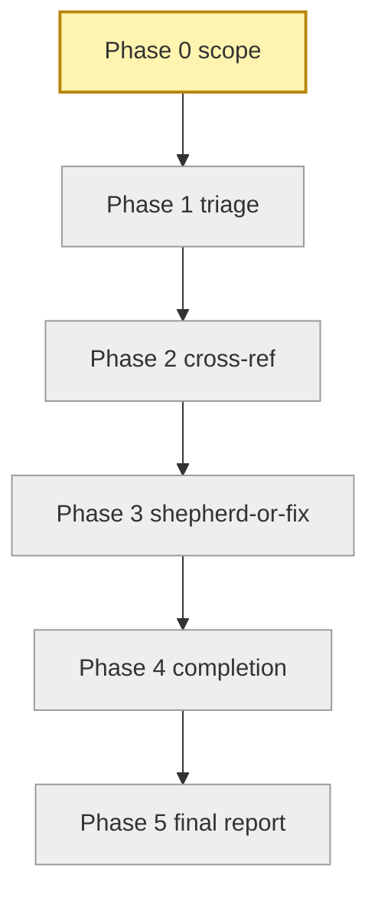
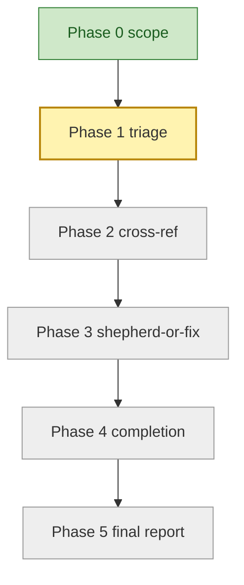
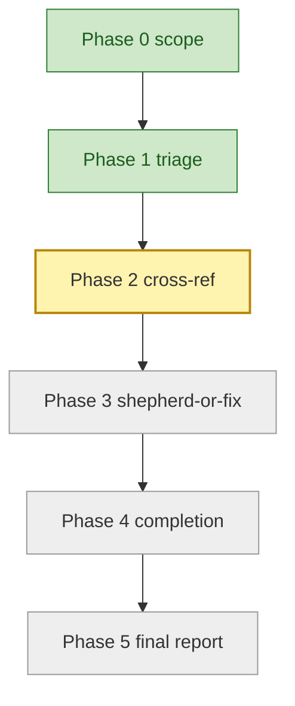
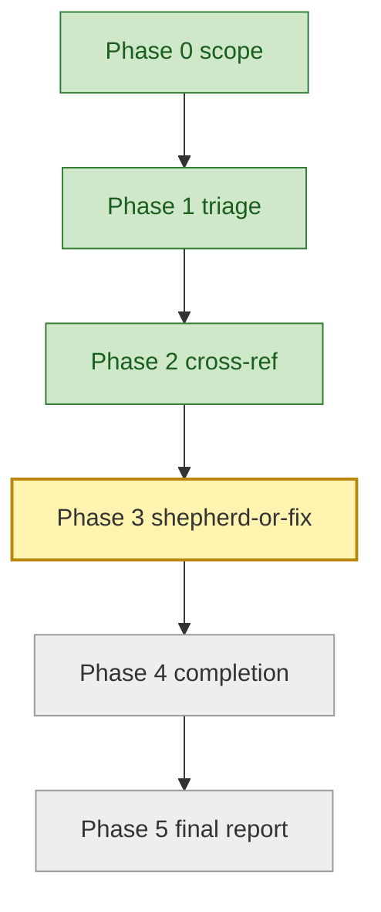
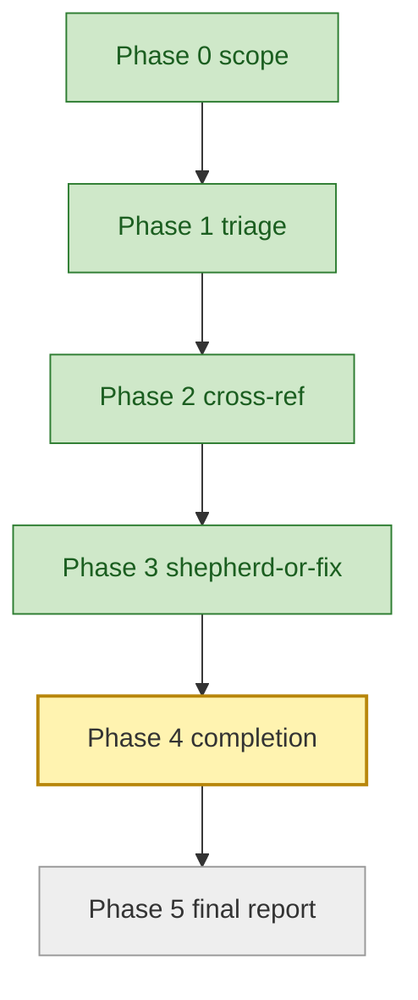
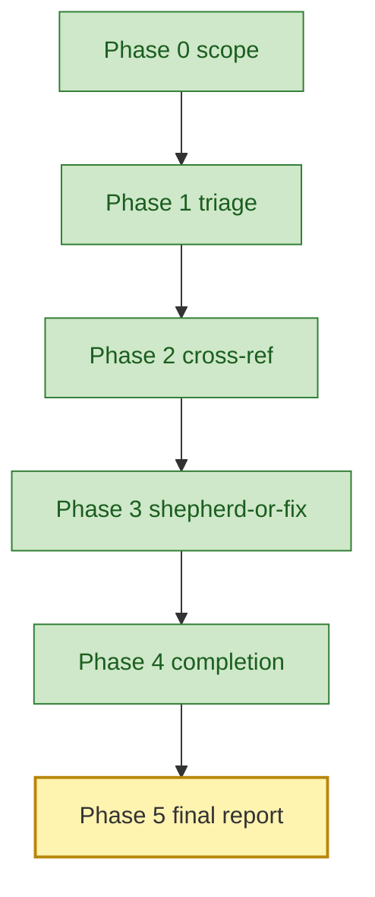

# Orchestrator session: with batch-bug-shepherd skill loaded

User: triage these bugs: #311 (CLI crash on empty config), #312
(auth: PAT lookup intermittent), #313 (deprecated --token-source
still in help text).

Orchestrator (activates batch-bug-shepherd skill by name; loads its
SKILL.md as the working spec, including the operator-visibility
contract in `assets/progress-diagram.md` and the bias-toward-folding
invariant covering `recommended_followups[]`).

## Progress (Phase 0 - scope resolution)

Three explicit issues, no sweep-all expansion needed. Below
threshold (20), proceeding without confirmation.

Ground-truth table written to plan.md:

| issue | verdict | pr | pr_in_flight | author | status | notes |
|-------|---------|----|----|--------|--------|-------|
| #311  | pending |    | unknown | -- | pending-triage | CLI crash on empty config |
| #312  | pending |    | unknown | -- | pending-triage | auth PAT lookup intermittent |
| #313  | pending |    | unknown | -- | pending-triage | --token-source help text |

## Progress (Phase 1 - triage fan-out)

Dispatch table (3 parallel triage subagents, one per candidate,
each loading `assets/triage-prompt.md`):

| subagent_id | target | persona      | brief                          |
|-------------|--------|--------------|--------------------------------|
| triage-311  | #311   | triage-prompt | Reproduce CLI crash on empty config |
| triage-312  | #312   | triage-prompt | Reproduce intermittent PAT lookup race |
| triage-313  | #313   | triage-prompt | Verify deprecated --token-source in help |

Returns (validated against `verdict-schema.json`):
- #311 -> LEGIT (reproduced via `apm init --config /dev/null`).
- #312 -> LEGIT (reproduced intermittently; race in AuthResolver cache).
- #313 -> FIXED-AT-HEAD; recommend close referencing #1402.

Table updated.

## Progress (Phase 2 - cross-reference)

Running `gh pr list --search "#311" --state open` and equivalent
for #312. Skipping #313 (FIXED-AT-HEAD).

Results:
- #311 -> no in-flight PR.
- #312 -> PR #1428 in flight (community contributor; head
  contoso:fix/auth-cache-race; maintainerCanModify=true).

Table updated. PHASE 2 COMPLETE; gating phase 3.

## Progress (Phase 3 - shepherd-or-fix fan-out)

Dispatch table (2 sub-waves running in parallel):

| subagent_id | target | persona         | brief                              |
|-------------|--------|-----------------|------------------------------------|
| shepherd-1428 | PR #1428 | shepherd-prompt | Activate apm-review-panel for PR #1428; return verdict + blocking_followups + recommended_followups |
| fix-311      | #311     | fix-prompt      | TDD fix for empty-config crash; mutation-break + lint contract |

Sub-wave 3a (SHEPHERD) returns: verdict `ready-to-merge`,
blocking_followups [] (0), recommended_followups carrying 3 items
each tagged with `source_persona` (test-coverage-expert,
python-architect, devx-ux) and `fold_hint` (fold, fold, defer).

Sub-wave 3b (FIX) returns: PR #1437 opened referencing #311; lint
silent; mutation-break gate honored (guard removed -> test FAILS).

Table updated.

## Progress (Phase 4 - completion fan-out)

Dispatch table:

| subagent_id     | target | persona           | brief                                                           |
|-----------------|--------|-------------------|-----------------------------------------------------------------|
| completion-1428 | PR #1428 | completion-prompt | RECOMMENDED_FOLLOWUPS=3; classify FOLD vs DEFER; fold legit items; `gh issue create` for DEFER |
| completion-1437 | PR #1437 | completion-prompt | Self-review; lint already silent; watch CI; confirmation on green |

Completion-1428 returns (validated against schema): status
`ready-to-merge`, folded_followups [2 items: regression test +
inline helper extraction], deferred_followups [1 item: devx-ux
cross-cutting flag rename filed as tracking issue #1450 with
rationale "cross-cutting refactor outside PR diff"].

Completion-1437 returns: status `ready-to-merge`, folded_followups
[], deferred_followups [] (no panel ran).

Cross-session-message ONLY on green; failures stay in-session.

## Progress (Phase 5 - final report)

Reading the final table; rendering `assets/final-report-template.md`:

- #311: LEGIT; PR #1437 (own-fix); status ready-to-merge.
- #312: LEGIT; PR #1428 (community); status ready-to-merge;
  2 recommended items folded, 1 deferred to tracking issue #1450.
- #313: FIXED-AT-HEAD; recommend close referencing #1402.

The orchestrator never posted to any PR directly; every PR-side
write was delegated to the responsible subagent. Single-writer
interlock honored. Lint contract honored on every push.
Mutation-break gate honored on the regression-trap test. Bias
toward folding honored: FOLD items landed in-PR, DEFER items
filed as tracking issues, none silently dropped.
